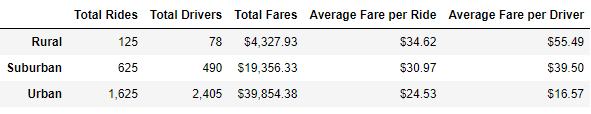

# PyBer Ride-Sharing Analysis
## Overview of the Project
PyBer ride-sharing data has been provided for analysis to examine the relationships between city types and total rides, drivers and fares. In the [PyBer Challenge file](PyBer_Challenge.ipynb), the PyBer city data and rides data were merged using the Pandas `pd.DataFrame.groupby()` function and grouped according to city types. The total rides, drivers and fares were calculated, as well as the average fares per rides and drivers, to observe any patterns in the data that might help inform PyBer decision-makers. Finally, a multiple-line graph showing the total weekly fares per city type was created using Matplotlib.
## Results
PyBer summary table:

The clearest pattern seen in this table is the relationship between the sizes of the total values and the city types. The total rides, drivers, and fares in rural cities are smaller than those in suburban cities, which are smaller than those in urban cities. This appears to correlate with the population sizes of the cities. On the contrary, average fares per ride and driver are larger in rural cities and then smaller in suburban and urban cities. When comparing the urban cities to both the rural and suburban cities, the proportion of rides to drivers is of note. Whereas rural and suburban cities have greater total rides than drivers, the urban total drivers are 0.5 times greater than urban total rides. This is reflected in the fare averages, where the average fare per urban driver is nearly $8 less than the average fare per urban ride.

After examining the weekly total fares graph, it appears that the total fares for each city type stay somewhat consistent from week to week. In a four-month period, the city-types' respective fares stay within a $800 range. Of note, both urban and suburban cities see a low in total fares at the start of January, possibly due to reduced travel during the holiday season. Additionally, all three city types share a spike in total fares during the third week of February.
## Summary
Based on the results of this analysis, my advice to PyBer is to focus marketing efforts on some urban cities to try increasing the total riders. The summary table shows that there are far more drivers than there are riders, and these extra drivers are not working because there isn't a demand for them.  From this bubble chart showing a fuller view of the ride-share data, it's clear that there are many urban cities that have similar total rides to suburban cities but have drastically more drivers. The second advice I would give is to examine fare rates in rural cities to determine if ride-shares are accessible and affordable. The average fare per ride is $10 higher than in urban cities, and this might be a deterrent to prospective riders. Finally, it would be helpful if data could be gathered on ride times/distances, as this might affect fare rates if drivers are paid by time driven, and it could dissuade prospective drivers if rides are generally time-intensive.
